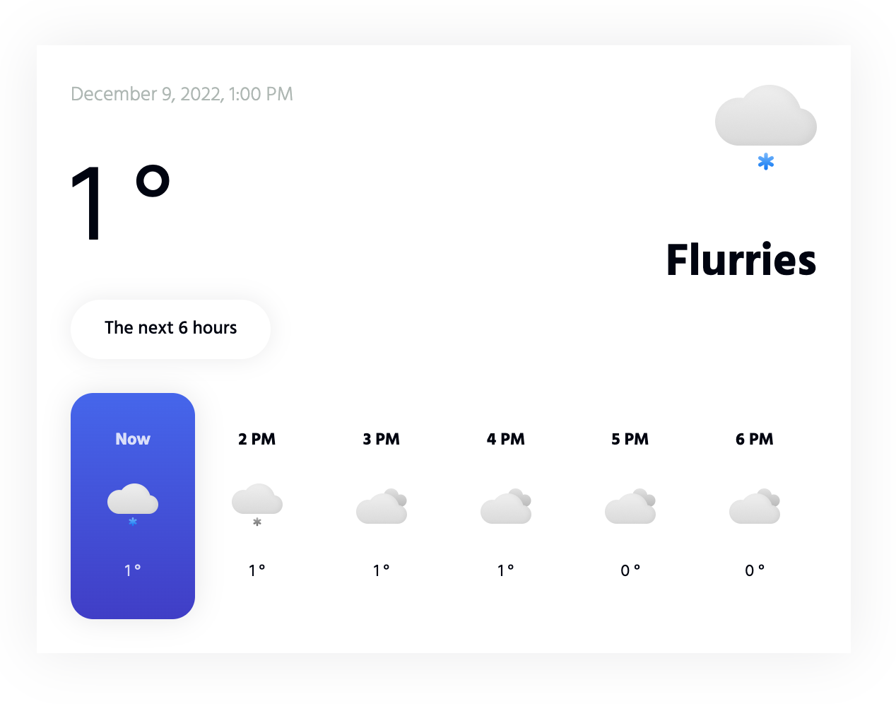

# WeatherWidget

A basic weather widget that displays the current weather conditions and a slider to navigate the next 24 hours in the future. Uses [Tomorrow.io Weather Api](https://tomorrow.io/weather-api) for the weather data.



## How to use

Embed the following HTML code in your website:

``` html
<weather-widget
  latitude=""
  longitude=""
  units=""
  timezone="">
</weather-widget>
```

And don't forget to embed the following scripts right before the closing `</body>` tag:

``` html
<!-- Scripts -->
<script src="runtime.js" type="module"></script>
<script src="polyfills.js" type="module"></script>
<script src="main.js" type="module"></script>
```

## Attributes

| Name         | Required |          type          | Default            |
| ------------ | :------: | :--------------------: | ------------------ |
| latitude     |   Yes    |        `string`        |                    |
| longitude    |   Yes    |        `string`        |                    |
| units        |    No    | `metric` or `imperial` | `metric`           |
| timezone     |    No    |        `string`        | `Europe/Amsterdam` |
| slider-items |    No    |        `number`        | `4`                |

## Development server

Run `ng serve` for a dev server. Navigate to `http://localhost:4200/`. The application will automatically reload if you change any of the source files.

## Build

Run `ng build:demo` to build the project. The build artifacts will be stored in the `demo/` directory.

## Running unit tests

Run `ng test` to execute the unit tests via [Karma](https://karma-runner.github.io).
